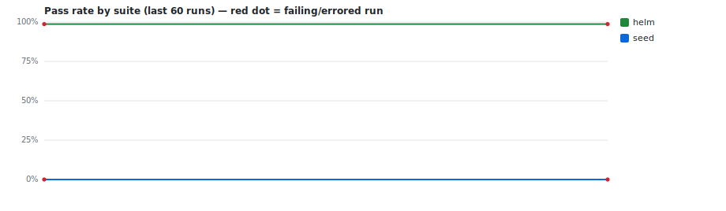

# CI test trends — `InteractiviteVideoEtSystemes/ai-accelerator-2026`

> Auto-generated by **PR Validation** (`publish-test-history`). Do not edit by hand — every
> run regenerates this branch. The machine-readable source of truth is [`runs.jsonl`](./runs.jsonl).
> Deployed-environment E2E trends live separately on the [`e2e-history`](../../tree/e2e-history) branch.

**Last updated:** 2026-06-24 20:11Z · 19 records · suites: `helm`, `seed`, `temporal`



## Suites

| Suite | Latest | When (UTC) | Pass 24h | Pass 7d | Green streak | Runs |
|---|---|---|--:|--:|--:|--:|
| `helm` | ❌ `failed` [↗](https://github.com/InteractiviteVideoEtSystemes/ai-accelerator-2026/actions/runs/28126584130) | — | — | — | 0 | 7 |
| `seed` | ❌ `failed` [↗](https://github.com/InteractiviteVideoEtSystemes/ai-accelerator-2026/actions/runs/28126584130) | — | — | — | 0 | 7 |
| `temporal` | ✅ `passed` [↗](https://github.com/InteractiviteVideoEtSystemes/ai-accelerator-2026/actions/runs/28126584130) | 2026-06-24 20:11Z | 100% (5) | 100% (5) | 5 | 5 |


## Recent runs

| When (UTC) | Suite | Result | Pass | Fail | Skip | Duration | Commit | Run |
|---|---|---|--:|--:|--:|--:|---|---|
| 2026-06-24 20:11Z | `temporal` | ✅ passed | 57 | 0 | 0 | 2.5s | `63e1d13` | [#8](https://github.com/InteractiviteVideoEtSystemes/ai-accelerator-2026/actions/runs/28126584130) |
| 2026-06-24 19:32Z | `temporal` | ✅ passed | 52 | 0 | 0 | 1.9s | `9e77ec5` | [#6](https://github.com/InteractiviteVideoEtSystemes/ai-accelerator-2026/actions/runs/28124351030) |
| 2026-06-24 19:30Z | `temporal` | ✅ passed | 52 | 0 | 0 | 1.9s | `a66d5c8` | [#5](https://github.com/InteractiviteVideoEtSystemes/ai-accelerator-2026/actions/runs/28124226896) |
| 2026-06-24 18:55Z | `temporal` | ✅ passed | 52 | 0 | 0 | 2.2s | `60d291a` | [#4](https://github.com/InteractiviteVideoEtSystemes/ai-accelerator-2026/actions/runs/28122276750) |
| 2026-06-24 17:29Z | `temporal` | ✅ passed | 11 | 0 | 0 | 0.0s | `80f7585` | [#3](https://github.com/InteractiviteVideoEtSystemes/ai-accelerator-2026/actions/runs/28117176926) |
| — | `seed` | ❌ failed | 0 | 1 | 0 | — | `63e1d13` | [#8](https://github.com/InteractiviteVideoEtSystemes/ai-accelerator-2026/actions/runs/28126584130) |
| — | `helm` | ❌ failed | 151 | 2 | 0 | — | `63e1d13` | [#8](https://github.com/InteractiviteVideoEtSystemes/ai-accelerator-2026/actions/runs/28126584130) |
| — | `seed` | ❌ failed | 0 | 1 | 0 | — | `9e77ec5` | [#6](https://github.com/InteractiviteVideoEtSystemes/ai-accelerator-2026/actions/runs/28124351030) |
| — | `helm` | ❌ failed | 151 | 2 | 0 | — | `9e77ec5` | [#6](https://github.com/InteractiviteVideoEtSystemes/ai-accelerator-2026/actions/runs/28124351030) |
| — | `seed` | ❌ failed | 0 | 1 | 0 | — | `a66d5c8` | [#5](https://github.com/InteractiviteVideoEtSystemes/ai-accelerator-2026/actions/runs/28124226896) |
| — | `helm` | ❌ failed | 151 | 2 | 0 | — | `a66d5c8` | [#5](https://github.com/InteractiviteVideoEtSystemes/ai-accelerator-2026/actions/runs/28124226896) |
| — | `seed` | ❌ failed | 0 | 1 | 0 | — | `60d291a` | [#4](https://github.com/InteractiviteVideoEtSystemes/ai-accelerator-2026/actions/runs/28122276750) |
| — | `helm` | ❌ failed | 151 | 2 | 0 | — | `60d291a` | [#4](https://github.com/InteractiviteVideoEtSystemes/ai-accelerator-2026/actions/runs/28122276750) |
| — | `seed` | ❌ failed | 0 | 1 | 0 | — | `80f7585` | [#3](https://github.com/InteractiviteVideoEtSystemes/ai-accelerator-2026/actions/runs/28117176926) |
| — | `helm` | ❌ failed | 151 | 2 | 0 | — | `80f7585` | [#3](https://github.com/InteractiviteVideoEtSystemes/ai-accelerator-2026/actions/runs/28117176926) |
| — | `seed` | ❌ failed | 0 | 1 | 0 | — | `610d889` | [#2](https://github.com/InteractiviteVideoEtSystemes/ai-accelerator-2026/actions/runs/28107194825) |
| — | `helm` | ❌ failed | 151 | 2 | 0 | — | `610d889` | [#2](https://github.com/InteractiviteVideoEtSystemes/ai-accelerator-2026/actions/runs/28107194825) |
| — | `seed` | ❌ failed | 0 | 1 | 0 | — | `6b3f316` | [#1](https://github.com/InteractiviteVideoEtSystemes/ai-accelerator-2026/actions/runs/28102453137) |
| — | `helm` | ❌ failed | 151 | 2 | 0 | — | `6b3f316` | [#1](https://github.com/InteractiviteVideoEtSystemes/ai-accelerator-2026/actions/runs/28102453137) |


## Unstable tests (recent window)

_No failing or flaky tests in the recent window. 🎉_


---

### Reading this data programmatically

```bash
# every line is one suite-run; newest last
git show ci-history:runs.jsonl | tail -n 20

# e.g. the unit suite's pass-rate over its last 50 runs
git show ci-history:runs.jsonl \
  | jq -rs '[.[] | select(.suite=="unit")] | .[-50:]
            | (map(select(.outcome=="passed")) | length) / length * 100'
```

Record shape: `{ ts, suite, outcome, pass_rate, stats:{expected,unexpected,flaky,skipped,total,duration_ms}, run_url, sha_short, branch, trigger, tests:[{title,file,status,duration_ms}] }`
